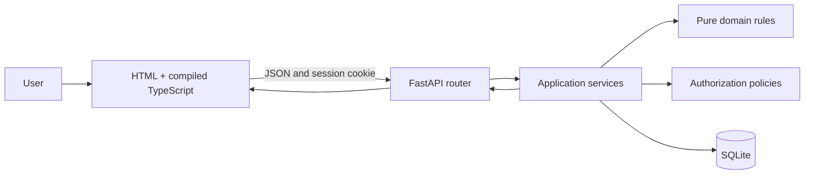
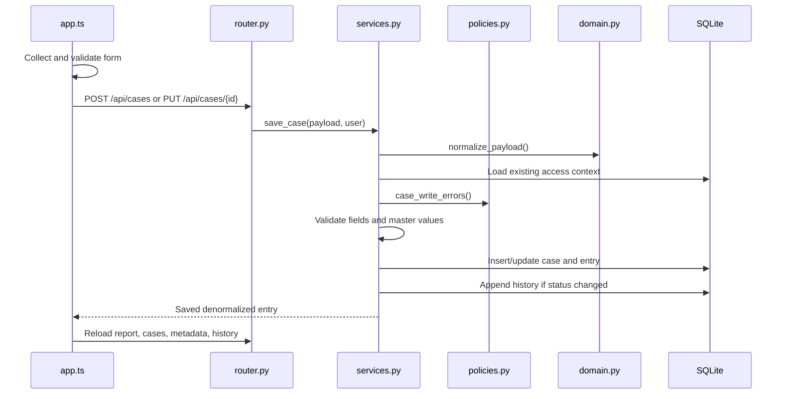

# Architecture and request flow

## Runtime structure

The application is served by one Python process. `backend/server.py` starts Uvicorn on `127.0.0.1:4173`. `backend/router.py` exposes `/api/*` first and mounts the `frontend` directory at `/`.

## Startup, step by step

1. `npm run build` compiles `frontend/app.ts` into `frontend/dist/app.js`.
2. `npm start` runs `backend/server.py`.
3. FastAPI's lifespan calls `services.init_db()`.
4. `init_db()` creates missing tables and seeds roles, statuses, locations, segments, holidays, the seven-day SLA, and demo users.
5. The browser loads `frontend/index.html`, CSS, and the generated JavaScript.
6. `bootstrap()` asks `/api/auth/me` whether a valid session already exists.
7. After authentication, the UI loads metadata, reports, case rows, and history concurrently.

## Login request

1. The login form calls `POST /api/auth/login`.
2. `services.authenticate()` finds an active user.
3. PBKDF2 recalculates the supplied password hash with that user's salt.
4. Constant-time comparison verifies the password.
5. A random token is returned to the router; only its SHA-256 hash is stored in SQLite.
6. The router sets a 12-hour HttpOnly, SameSite-strict `session` cookie.
7. Later routes resolve the cookie through `require_user()`.

## Save-case request

Frontend validation improves feedback, but backend validation is authoritative. The authenticated session supplies `changed_by`; the client cannot choose it.

## Read/report request

`GET /api/reports` selects the latest entry for each case, reads its complete status history, calculates query and TAT metrics, masks PAN, applies role visibility, and returns summary, pipeline, grouped MIS, and case-detail arrays.

